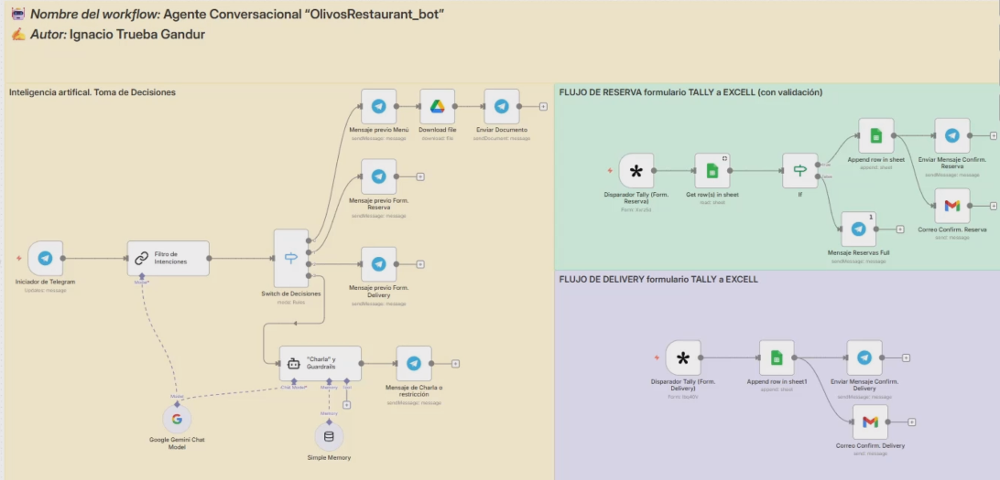

# Agente Conversacional Inteligente con Gemini AI y n8n — Olivos Restaurant

Este repositorio contiene la arquitectura de automatización y la lógica de backend para un **Asistente Virtual Inteligente** diseñado para el sector gastronómico (Olivos Restaurant). El sistema utiliza **n8n** como motor principal de orquestación de flujos de trabajo y el modelo fundacional avanzado **Google Gemini** para dotar al agente de capacidades conversacionales avanzadas y comprensión del lenguaje natural.

## 📊 Problema que Resuelve la Solución
Los canales tradicionales de atención en restaurantes (llamadas o chats manuales) sufren de cuellos de botella operativos en horas pico, lentitud en las respuestas y fatiga en la gestión de preguntas frecuentes (menú, horarios, reservas). 

Este proyecto resuelve este desafío mediante la creación de un **Agente de IA Autónomo** capaz de:
1. Gestionar de extremo a extremo la interacción con el cliente en tiempo real a través de **Telegram**.
2. Comprender intenciones complejas, responder dudas sobre el menú y asistir en procesos interactivos de manera fluida y humana.
3. Centralizar y automatizar la lógica de negocio visualmente sin depender de código propietario rígido.

## 🛠️ Arquitectura del Flujo y Componentes Clave

El flujo de trabajo se despliega de forma visual e intuitiva en n8n, estructurándose mediante los siguientes nodos principales:

* **Telegram Trigger:** Nodo de entrada que actúa como Webhook activo, capturando instantáneamente cada mensaje, imagen o comando enviado por el usuario al bot de Telegram.
* **AI Agent (Core):** El nodo central que orquesta la sesión conversacional. Administra la memoria del chat y decide qué acciones o herramientas ejecutar basándose en el contexto.
* **Google Gemini Chat Model:** Integración directa con la API de Google Gemini, configurado con un *System Prompt* personalizado que define la personalidad del asistente, las directrices del restaurante, la estructura de precios y las políticas de atención.
* **Window Buffer Memory:** Componente de memoria adjunto al agente que le permite retener el hilo y contexto de las últimas interacciones de la conversación con el cliente, asegurando una experiencia cohesiva.

## 🚀 Instrucciones de Configuración e Importación

Para replicar o auditar este flujo de trabajo en tu propia instancia de n8n:

1. **Importar el Flujo:**
   - Abre tu panel de n8n.
   - Crea un flujo nuevo vacío.
   - Haz clic en el menú de los tres puntos (`...`) en la esquina superior derecha y selecciona **Import from File**.
   - Selecciona el archivo `OlivosRestaurant_bot.json` incluido en este repositorio.

2. **Configurar Credenciales:**
   - **Telegram API:** Genera tu token de bot con [@BotFather](https://t.me/BotFather) y añádelo en el nodo correspondiente.
   - **Google Gemini API:** Obtén tu API Key desde Google AI Studio e instálala en el nodo del modelo de chat.

3. **Activar:** Guarda los cambios y activa el interruptor (**Active**) en la parte superior derecha de n8n.

---
*Este proyecto fue desarrollado con fines educativos y de portafolio para demostrar la viabilidad de arquitecturas No-Code/Low-Code potenciadas con Inteligencia Artificial generativa.*